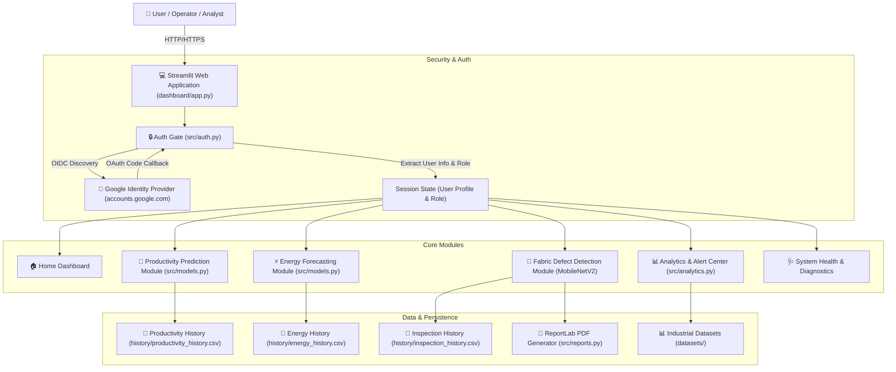

# SilkTrace — Architectural & System Documentation

## 1. Overview & Core Mission
**SilkTrace** is an enterprise-grade AI decision-support and data analytics platform tailored for textile manufacturing plants, power-loom clusters, and garment production units.

The system integrates:
- **Worker Productivity Optimization** via Random Forest Regression (14 features).
- **Industrial Energy Consumption Forecasting** via Random Forest Regression (10 features).
- **Fabric Defect Quality Inspection** via MobileNetV2 Deep Learning (Computer Vision classification for Hole, Horizontal, Vertical defects).
- **Google Cloud OpenID Connect (OIDC)** Authentication with Role-Based Access Control (RBAC).
- **Executive Analytics & Operational Alert Engine** driven by real manufacturing datasets.
- **Automated Cross-Platform PDF & CSV Reporting**.

---

## 2. End-to-End System Architecture

---

## 3. Data Flow & Security Lifecycle

### 3.1 Authentication Sequence (Native Streamlit OIDC)
1. User hits application entry point (`dashboard/app.py`).
2. `handle_auth_gate()` in `src/auth.py` evaluates `st.user.is_logged_in` (and isolated `st.session_state["demo_authenticated"]`).
3. If unauthenticated, access is halted via `st.stop()`, displaying the branded login screen with "Continue with Google" button and Demo Access option.
4. User clicks "Continue with Google" -> Streamlit invokes `st.login()`, natively redirecting to Google's OIDC authorization endpoint.
5. Upon user consent, Google redirects to `/oauth2callback`, where Streamlit's Tornado server layer natively handles the callback, verifies OIDC tokens, and issues an encrypted session cookie via standard HTTP `Set-Cookie` response headers.
6. `st.user` is populated with `name`, `email`, `picture`, `sub`.
7. User email is evaluated against `SILKTRACE_ROLE_MAP` (`ADMIN`, `ANALYST`, `OPERATOR`, `VIEWER`) via `get_user_role(st.user.email)`.
8. User is granted access across browser tabs, reloads, and multi-session navigation without authentication loops.
9. Logout is handled cleanly via `st.logout()`.

### 3.2 Machine Learning Inference Pipelines
- **Productivity Model**: Random Forest Regressor (14 features). Input validated -> Categorical features label-encoded -> Predict actual productivity -> Derive status vs target -> Log execution timestamp to `history/productivity_history.csv`.
- **Energy Model**: Random Forest Regressor (10 features). Input validated -> Predict usage in kWh -> Evaluate consumption tier -> Log execution timestamp to `history/energy_history.csv`.
- **Fabric Defect Model**: MobileNetV2 (224x224x3 float32 normalized image tensor). Forward pass -> Output softmax probabilities for Hole, Horizontal, Vertical -> Calculate confidence -> Render Plotly distribution -> Generate ReportLab PDF report (`reports/inspection_report.pdf`).

---

## 4. Production Deployment Topology (Render)
- **Runtime**: Python 3.12
- **Process Manager**: Streamlit Headless Server
- **Port Bounding**: `--server.address 0.0.0.0 --server.port $PORT`
- **Model Storage Strategy**: Lightweight models committed; heavy weights (>40MB) lazily streamed from official GitHub Releases tag `v1.0.0` on first load.
